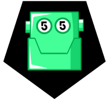

The purpose of this project is to facilitate the booking of futsal "soccer five" game slots.\
Currently only LE FIVE (https://lefive.fr) centers are available.

## Install and run

Requirement: Node.js + npm

1. Clone the repo
2. Run `npm i`
3. Run `npm run get-slot`

## Custom

The script works by time iteration, meaning it will gives you each slots available in the date and time range you have setted.\
You can the number of weeks you want to check (starting today), wich day you want to play, at what time and where (centers).

At the moment game duration is not customisable (set to 60 min) but you can set it in the request.

### Weeks

Edit `WEEKS_FROM_NOW` to set until when you want you want to check slots.\
The script start from today (the day when you run the script).

> Eg. `WEEKS_FROM_NOW = 4` will request slots for the next 4 weeks.

### Week days

Edit `WEEK_DAYS` to set wich days of the week you want to play.

> Eg. `WEEK_DAYS = [1, 2, 6]` will request slots for Monday, Tuesday and Saturday.

### Times

Edit `TIME_START` and `TIME_END` (24-hour) to set your wanted time range.\
The script will check every 30 minutes slots between this two times.

> Eg. `TIME_START = '19:00'` and `TIME_END = '20:30'` will request 3 slots (19:00, 19:30, 20:00).

### Centers

To add center you can take somes in the list bellow and add them in the `centers` const.

> Eg. centers = [ LE_FIVE_VILETTE, LE_FIVE_PARIS_18 ]` will search in the 2 centers.

#### List of centers: (up-to-date on 31/03/2022)

```javascript
// Île-de-France
const LE_FIVE_BEZON = 18;
const LE_FIVE_BOBIGNY = 19;
const LE_FIVE_CARRIERES = 4;
const LE_FIVE_CHAMPIGNY = 5;
const LE_FIVE_CRETEIL = 25;
const LE_FIVE_MARVILLE = 25;
const LE_FIVE_MORANGIS = 59;
const LE_FIVE_PARIS_13 = 51;
const LE_FIVE_PARIS_17 = 63;
const LE_FIVE_PARIS_18 = 69;
const LE_FIVE_SARCELLES = 35;
const LE_FIVE_SARCELLES = 35;
const LE_FIVE_VILETTE = 39;

// Nord
const LE_FIVE_DUNKERQUE = 49;
const LE_FIVE_LENS = 41;
const LE_FIVE_ROUEN = 12;
const LE_FIVE_VALENCIENNES = 52;

// Grand-Est
const LE_FIVE_METZ = 53;
const LE_FIVE_MULHOUSE = 50;
const LE_FIVE_NANCY = 43;
const LE_FIVE_REIMS = 47;
const LE_FIVE_SAINT_LOUIS_BALE = 61;
const SOCCER_PARK_STRASBOURG = 10;

// Centre
const LE_FIVE_ORLEANS_FLEURY = 9;
const LE_FIVE_ORLEANS_INGRE = 31;

// Rhône-Alpes PACA
const LE_FIVE_ANNEMASSE = 16;
const LE_FIVE_ANTIBES = 1;
const LE_FIVE_LYON = 71;
const LE_FIVE_VITROLLES = 40;

// Nouvelle-Aquitaine & Occitanie
const LE_FIVE_BORDEAUX = 2;
const LE_FIVE_LA_ROCHELLE = 42;
const LE_FIVE_LIMOGES = 48;
const LE_FIVE_PAU = 7;
const LE_FIVE_PERPIGNAN = 33;

// Réunion
const LE_FIVE_SAINT_LOUIS_LA_REUNION = 52;
```
